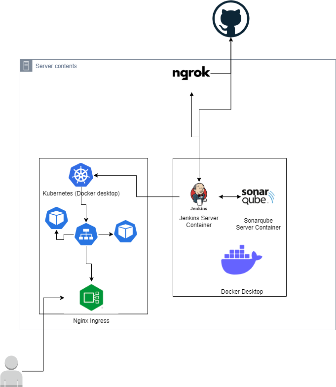
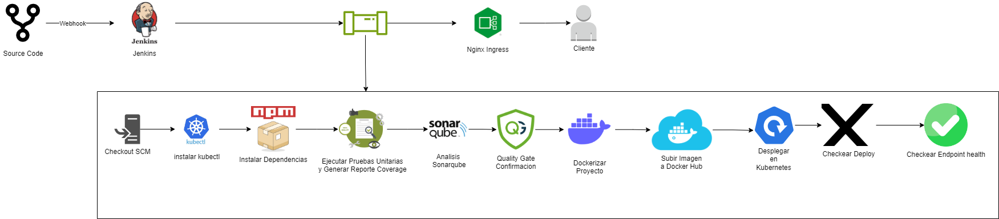
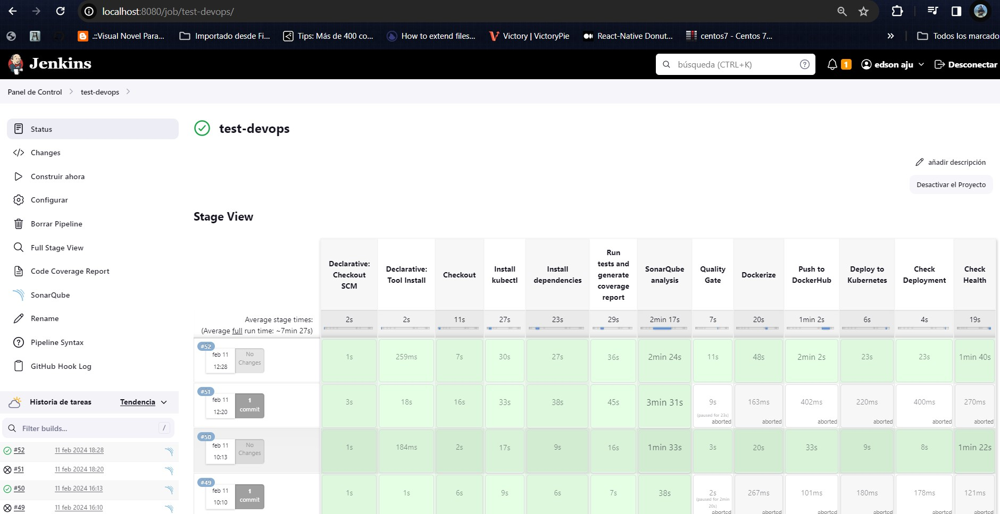
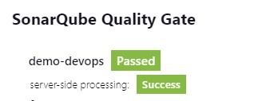
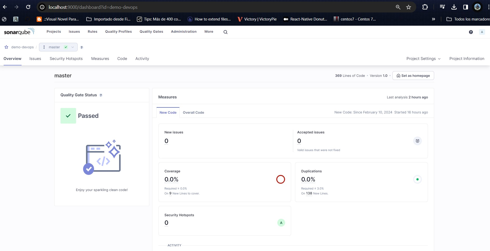
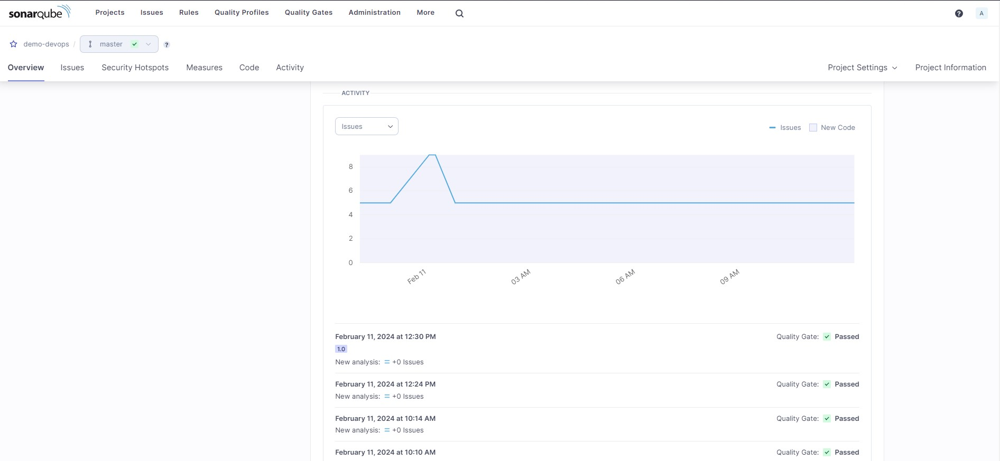

# Nombre del Proyecto

Este proyecto es una aplicación Node.js que se despliega en Kubernetes y utiliza Jenkins para la CI/CD. Incluye configuraciones de Docker, SonarQube, y una base de datos PostgreSQL.

## Instalación

1. Clona este repositorio:
git clone https://github.com/tu-usuario/tu-proyecto.git

2. Configura tu entorno de desarrollo:

cd tu-proyecto
docker-compose up -d

3. Accede a la aplicación en tu navegador web:

http://localhost:8000

## Uso

- Para ejecutar la aplicación localmente, ejecuta el siguiente comando:

npm start

- Para ejecutar las pruebas, utiliza el siguiente comando:

npm test

- Para desplegar la aplicación en Kubernetes, asegúrate de tener configurado `kubectl` y ejecuta el siguiente comando:

kubectl apply -f deployment-config.yaml

## Estructura del Proyecto

- **docker-compose.yml**: Archivo de configuración de Docker Compose.
- **deployment-config.yaml**: Archivo de configuración de Kubernetes para el despliegue.
- **jenkinsfile**: Archivo Jenkinsfile para la pipeline CI/CD.
- **dockerfile**: Archivo Dockerfile para la imagen de Docker.
- **sonar-project.properties**: Configuración de SonarQube.
- **index.js**: Archivo que contiene el código fuente principal de la aplicación.
- **index.test.js**: Archivo que contiene las pruebas automatizadas.

## Diagrama de Arquitectura General

## Diagrama de Pipeline en Jenkins

## Evidencias del proyecto
### Pipelines Completados

### Jenkins Sonar Completado

### Sonar Evidencia

## Contribución

Si quieres contribuir a este proyecto, sigue estos pasos:

1. Realiza un fork del repositorio.
2. Crea una nueva rama (`git checkout -b feature/nueva-caracteristica`).
3. Realiza tus cambios y haz commit (`git commit -am 'Agrega una nueva característica'`).
4. Haz push a la rama (`git push origin feature/nueva-caracteristica`).
5. Abre una solicitud de extracción.

## Licencia

Este proyecto está licenciado bajo [Licencia MIT](LICENSE).
